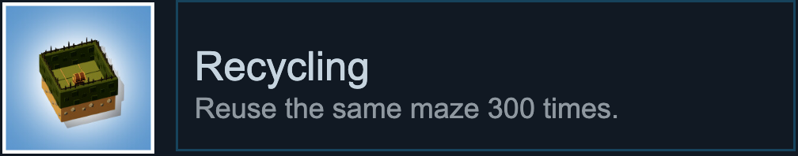
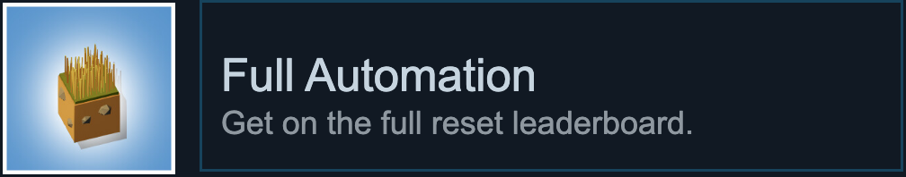

+++
title = "The Farmer Was Replaced Achievement Guide"
date = 2026-07-01
slug = "farmer-was-replaced-achievement-guide"
+++

The Farmer Was Replaced is a lovely idle game about programming a drone in a subset of the Python language to "farm" progressively more complicated crops. Farm lives in scarequotes mostly because efficiently farming each crop
As agentic coding takes over more and more of my day job as a developer, this was a lovely

About two thirds of the achievements in this game will occur through natural play, and are omitted from the guide. The remainder will be grouped by resource type.

## Achievements

### Sunflower Master & Big Power Farmer

{{ side_by_side(img1="045_sunflower_master.png", alt1="Farm 12000 power in 1 minute.", img2="033_big_power_farmer.png", alt2="Farm 100000 power.") }}

These are worth figuring out first, because you'll want a stash of excess Power in order to move fast enough to do anything below. This really simply assigns each drone a column of your farm, plants Sunflowers, and then scans the column over and over again for anything to harvest.

This pays no heed to the internal game rules to maximize production and still yields about **14,000 Power per minute**. Plenty for our purposes.

TODO: add gif

```python
import Movement
import Planting

entity = Entities.Sunflower
instructions = Planting.get_instructions(entity)

def driver(x, y):
    Movement.move_to(x, y)
    while True:
        if can_harvest():
            harvest()
        instructions()
        move(North)

clear()
for x in range(1, 32):
    spawn_drone(driver, x, 0)
driver(0, 0)
```

### Hay Master & Big Hay Farmer

{{ side_by_side(img1="054_hay_master.png", alt1="Farm 200 million hay in 1 minute.", img2="043_big_hay_farmer.png", alt2="Farm 1 billion hay.") }}

The Hay related achievements can be tackled by making efficient use of [Polyculture](https://thefarmerwasreplaced.wiki.gg/wiki/Polyculture) and keeping your [Water](https://thefarmerwasreplaced.wiki.gg/wiki/Watering) levels high enough.

The algorithm is fairly simple for this one and really only is harvesting a single plot. Space each of your drones out into a grid with 5 spaces between them. Then, you can simply call `get_companion()` on the drone to grab the Polyculture requirements, plant that and then just come back to your plot. Each adjacent drone will technically share a single space and occasionally collide, but this is a very rare race condition not worth optimizing.

TODO: add gif

```python
import Await
import Movement
import Planting
import Polyculture

entity = Entities.Grass
instructions = Planting.get_instructions(entity)

def driver(x, y):
    Movement.move_to(x, y)
    instructions()
    while True:
        while get_water() < 0.75:
            use_item(Items.Water)
        Polyculture.polyculture(entity)
        Await.await_harvest()
        harvest()

clear()
for i in range(6):
    for j in range(6):
        if i + j != 0:
            spawn_drone(driver, 3 + i * 5, 3 + j * 5)
driver(3, 3)
```

Following this correctly should yield around **550,000,000 Hay per minute**.

### Wood Master & Big Wood Farmer

{{ side_by_side(img1="055_wood_master.png", alt1="Farm 1 billion wood in 1 minute.", img2="038_big_wood_farmer.png", alt2="Farm 1 billion wood.") }}

This is where things get a bit more difficult. The Hay algorithm is insufficient here because it will get bottlenecked on the much longer time Trees take to grow.

Instead, we play a trick with the Polyculture system where we re-plant over and over again until we get a desirable outcome. Assign each drone a column, and plant Trees in a checkerboard pattern, leaving Hay wherever Trees are not placed. When planting a new tree, immediately call `get_companion()` on it. If the resulting pairing is not Hay or if the distance from the origin tile is equal to 2 (per the checkerboard pattern), retry.

### Carrot Master & Big Carrot Farmer

{{ side_by_side(img1="057_carrot_master.png", alt1="Farm 200 million carrots in 1 minute.", img2="046_big_carrot_farmer.png", alt2="Farm 1 billion carrots.") }}

Carrots share the exact same problem space as Tree farming, so we can just copy that solution and apply it here, too.

### Cactus Master & Big Cactus Farmer

{{ side_by_side(img1="047_cactus_master.png", alt1="Farm 20 million cacti in 1 minute.", img2="040_big_cactus_farmer.png", alt2="Farm 100 million cacti.") }}

Cactus require using drones to sort each column and row in parallel with each other. The one real snag is that if a drone starts sorting a column while another is still sorting a row their efforts will conflict with each other. To further complicate this, drones have no channel to communicate with each other directly, they can only check if other drones exist.

The solution to this is to maintain a 'master' drone that delegates its' tasks to slave drones, and use the death of a drone when its' task finishes to signal that a row or column has finished. So the process becomes simply assign drones to sort rows -> wait for them to finish -> assign drones to sort columns - wait again -> harvest -> repeat.

### Wrong Order

{{ side_by_side(img1="041_wrong_order.png", alt1="Sort a full field of cacti the wrong way round." ) }}

For Wrong Order, simply use sort_desc instead of sort_asc in the Cactus code above.

### Pumpkin Master & Big Pumpkin Farmer

{{ side_by_side(img1="056_pumpkin_master.png", alt1="Farm 20 million pumpkins in 1 minute.", img2="042_big_pumpkin_farmer.png", alt2="Farm 100 million pumpkins.") }}

Pumpkin Master requires parallelizing the farming of one giant farm-sized pumpkin while managing Fertilizer usage. Assign each drone a column and set them up to make 2 passes over the field. On the first pass the drone simply plants a Pumpkin in each row. On the second pass, find any failed crops and re-plant them while using Fertilizer to speed up growth.

The above strategy is fairly straight forward, the only problem is - how do you know when to call `harvest()`? Pumpkins have an undocumented property we can take advantage of: they assign themselves a unique integer that you can discover with `measure()`. Pumpkins that merge together also take on the identity of the oldest surviving Pumpkin. So if each drone stores the identifier of the first Pumpkin it plants they can check what the identifier of the Pumpkin underneath them is after they have finished both passes. If the identifier matches their first plant, call `harvest()` and start over again.

#### Maze Master


#### Recycling



#### Big Gold Farmer


#### Full Automation



### Dino Master, Long Dinosaur, Size Matters, & Big Bone Farmer

{{ side_by_side(img1="048_dino_master.png", alt1="Farm 1 million bones in 1 minute.", img2="032_long_dinosaur.png", alt2="Have a dinosaur that fills the entire farm." ) }}

{{ side_by_side(img1="039_size_matters.png", alt1="Get a dinosaur to length 1000." img2="044_big_bone_farmer.png" alt2="Farm 100 million bones.") }}

These are actually probably the easiest of the "big" achievements to actually implement, and can all be done in the same script. The concept we're looking for is called a Hamiltonian Cycle, which is a fancy way of saying a path the Snake can reliably take that covers each square on the farm while returning to where it started from. By dumbly retracing this one singular path over and over, we guarantee both that the Snake will never collide with itself and that it grows to maximum length. It just so happens to be fast enough to break the Dino Master threshold too, but you may need to let it run long enough to get a lucky run or two.

In pseudo-code, this is sufficient to get the job done:

```text
Start at [0, 0]
While the Snake has not found the right edge of the map:
    move North until you hit the top of the map
    move East one square
    move South until you reach y == 1
move South 1
move West until you hit [0, 0]
```

Besides this, the only other thing to do is check during each move to see if you are able to move to the next block. If you cannot, you have hit your exit condition and have filled the entire map with your Snake. Change your hat and start again.

## Common Code

Some code is shared amongst most or all the achievement scripts. They are detailed here for reference:

```python
# Movement

def noop():
    return

def move_to(x, y, protocol=noop):
    while get_pos_x() < x:
        protocol()
        move(East)
    while get_pos_x() > x:
        protocol()
        move(West)
    while get_pos_y() < y:
        protocol()
        move(North)
    while get_pos_y() > y:
        protocol()
        move(South)

```
